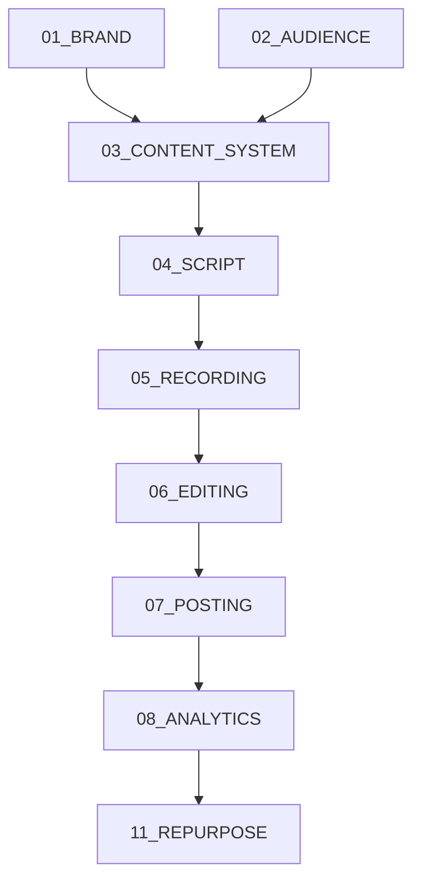

# Knowledge Dependency Map

## Conceptual Dependency Flow
Based on `knowledge/03_CONTENT_SYSTEM/Content Operating System.txt` and domain contents, the knowledge dependencies are strictly linear and cumulative.

## Detailed Relationships

### SOURCE: 01_BRAND & 02_AUDIENCE -> TARGET: 03_CONTENT_SYSTEM
**RELATIONSHIP:** Foundational constraints.
**EVIDENCE:** Content hooks and CTAs (in 03) must use the vocabulary (PAS framework, Sage archetype) defined in 01, targeting the pain points defined in 02.
**IMPACT IF SOURCE IS MISSING:** The content system becomes generic; AI generation will lose the unique "Giraldo Nainggolan" voice.
**IMPACT IF TARGET IS INCOMPLETE:** Scripts will lack structure (Hooks, CTAs).

### SOURCE: 03_CONTENT_SYSTEM -> TARGET: 04_SCRIPT
**RELATIONSHIP:** Pipeline entry point.
**EVIDENCE:** Content System provides the "IDE" and "RESEARCH" which feed into the "SCRIPT" stage.
**IMPACT IF SOURCE IS MISSING:** No ideas to script.
**IMPACT IF TARGET IS INCOMPLETE (CURRENT REALITY):** Because `04_SCRIPT.docx` is corrupt, the system lacks the exact validation checklist required to move an Idea to a Script. Developers will have to guess the required database fields.

### SOURCE: 04_SCRIPT -> TARGET: 05_RECORDING
**RELATIONSHIP:** Execution blueprint.
**EVIDENCE:** Recording requires a "Ready" script to begin generating A-Roll and B-Roll.
**IMPACT IF SOURCE IS MISSING:** Recording has no context.
**IMPACT IF TARGET IS INCOMPLETE:** The system won't know which B-Roll categories (e.g., 'Keyboard', 'Coffee' from 05) to attach to which script sections.

### SOURCE: 05_RECORDING -> TARGET: 06_EDITING
**RELATIONSHIP:** Asset supply.
**EVIDENCE:** Editing combines Raw Video (from 05) with Meme Bank assets (from 06).
**IMPACT IF SOURCE IS MISSING:** Nothing to edit.
**IMPACT IF TARGET IS INCOMPLETE:** Final exports won't match the required format for Posting.

### SOURCE: 06_EDITING -> TARGET: 07_POSTING (Empty)
**RELATIONSHIP:** Output delivery.
**EVIDENCE:** The pipeline explicitly maps EDIT -> CAPTION -> HASHTAG -> UPLOAD.
**IMPACT IF SOURCE IS MISSING:** No final video.
**IMPACT IF TARGET IS INCOMPLETE:** The system must assume manual uploading, as there are no SOPs defining API integrations for Posting.
