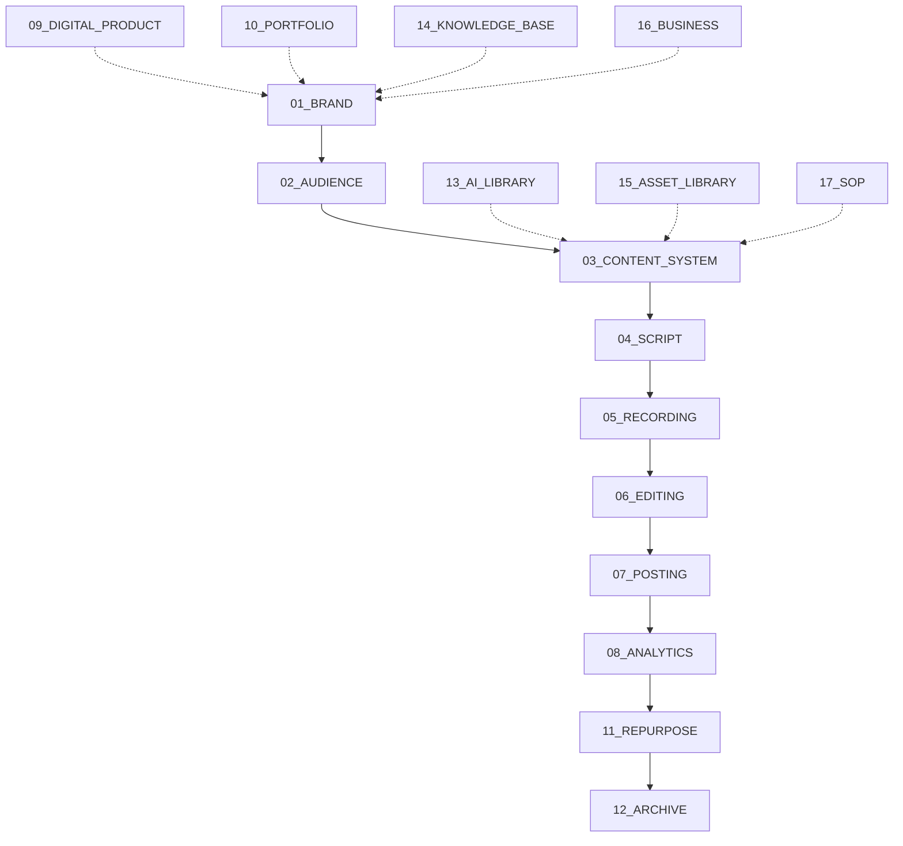

# DOMAIN DEPENDENCY MAP

## The 13-Stage Content Pipeline
As mapped from `README.md` and `03_CONTENT_SYSTEM` evidence:

## Supported Source Relationships
- **ContentSystem -> Script -> Record -> Edit -> Post -> Analytics**: Explicitly supported by `README.md` Content Pipeline array.
- **Brand -> Audience -> ContentSystem**: Supported by the fundamental architecture of the Brand & Content Operating System. Brand defines the tone, Audience receives it, Content System structures it.
