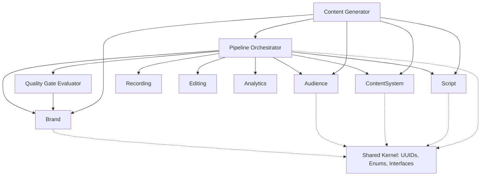

# Module Dependency Map
**Status:** PROPOSED

## Dependency Rules
As dictated by ADR-002:
1. Dependencies always point INWARD towards the core domains.
2. `Pipeline` depends on ALL domains.
3. Domains DEPEND ON NOTHING (except Shared Kernel).
4. `QualityGate` depends on `Brand` (to read rules).
5. `Generator` depends on `Brand`, `Audience`, `ContentSystem`, `Pipeline`, and `Script`.

## Mermaid Architecture Map

*Note: Arrows indicate code dependencies (e.g., `Pipeline` Application layer calls `Script` Application layer via DTOs). Dispatched Domain Events follow inverse pub/sub flows at runtime but do not create compile-time dependencies.*
